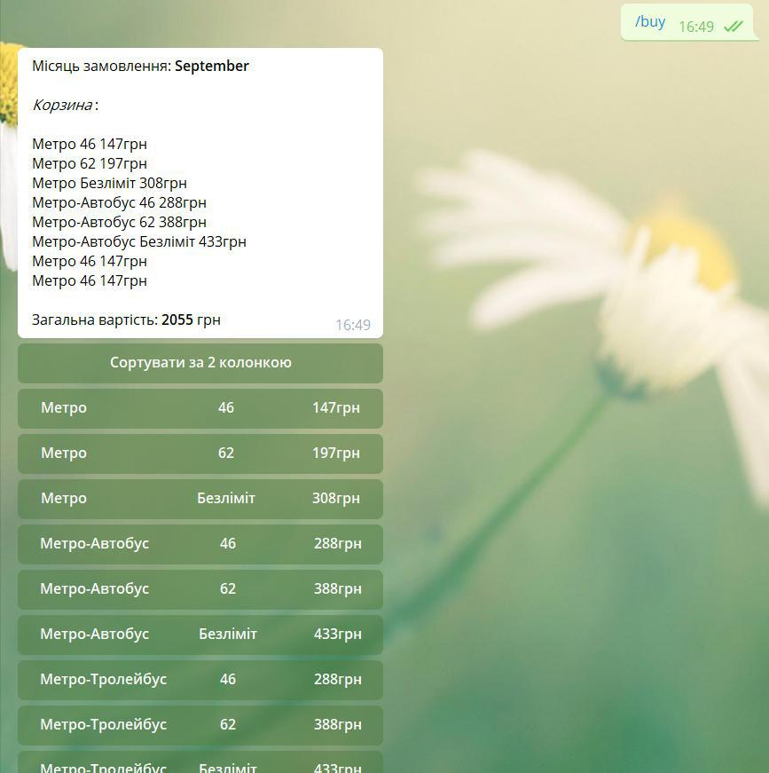
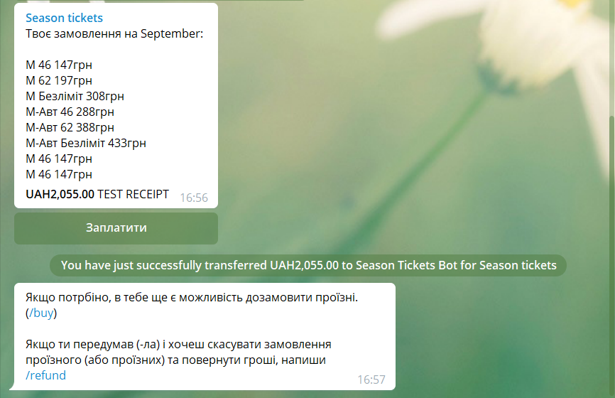
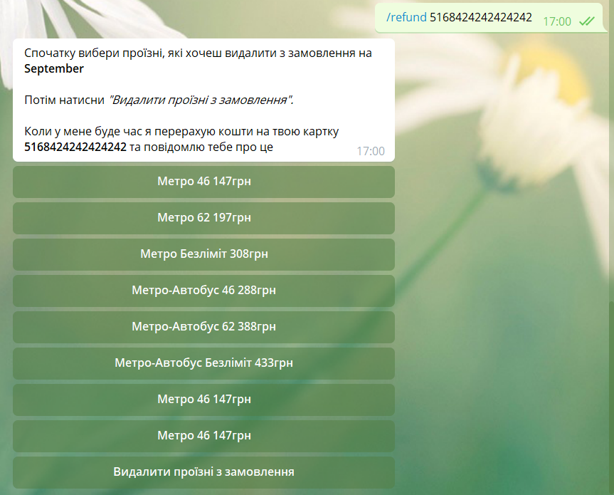
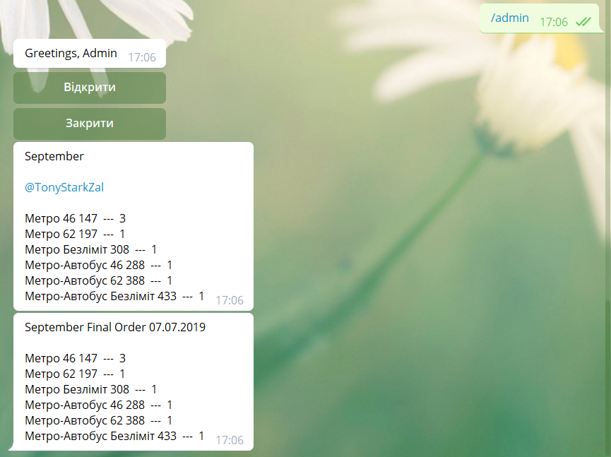

# Season Tickets Telegram Bot
## Link: https://t.me/SeasonTicketsBot
## Description
Telegram bot for buying and selling season tickets in Kyiv (Ukraine). 
Made for SE students of the National University of "Kyiv-Mohyla Academy".
### Features:
+ **Admin** - the person who manages season tickets orders, time of open (closed) access to the bot to make orders, 
people who can order tickets etc. Can '*open*' and '*close*' access for users to order tickets. Can add people that 
can make orders of season tickets
+ **Cart** - the temporary storage for tickets that a customer wants to order. Season tickets can be added or removed
 from the *cart*
+ **Orders** - the final orders of a customer (customers). When a customer pays his/her order, tickets from the *cart* 
are moved to the *order*. When admin *closes* the access, all orders are fetched 
from the database and sent to him in an appropriate form. Also the order of every customer is sent to that customer and
 to admin
+ **Refund** - the request made by a customer to cancel his/her order of ticket (tickets). This request with 
the card number of that customer is sent to admin, so he/she can return the money of the customer
## Screenshots

-

-

-

-
## License and copyright
Copyright (C) 07.07.2019 Anton Zalinyi, software engineer in the National University of "Kyiv-Mohyla Academy"

Licensed under the [MIT License](https://github.com/TonyStarkZal/Season-Tickets-Telegram-Bot/blob/master/LICENSE).
